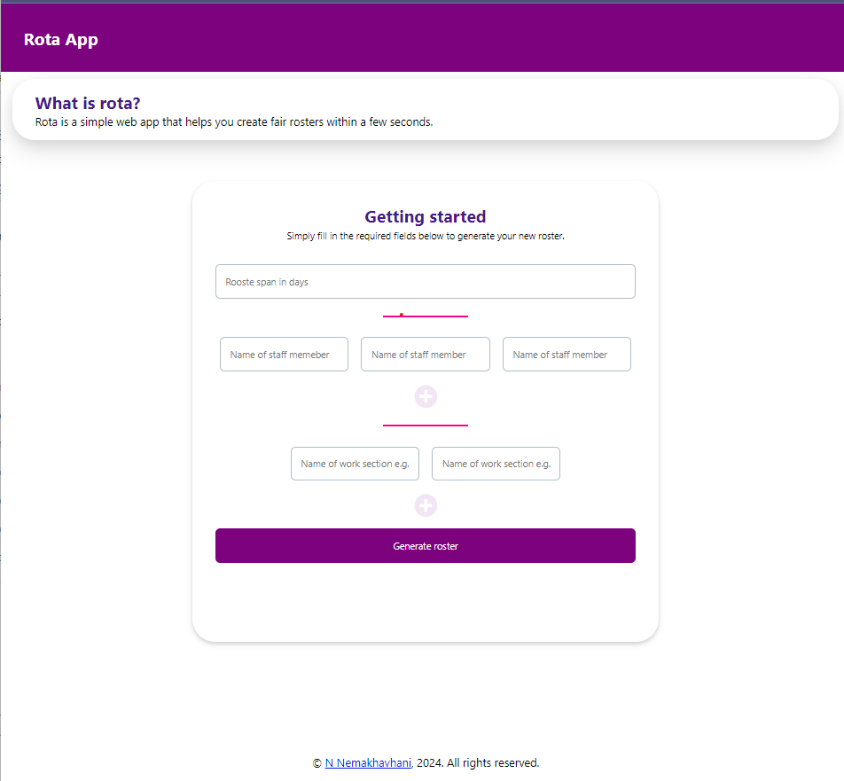

# Rota App - Automatic Shift Scheduler(Preview)

* A vanillaJS appfor teams to quickly generate fair rosters. 

> For example, if you have a team of 10 people and you need to schedule shifts for 5 days, the app will attemot to  generate a schedule that ensures that each person works 2 days and has 3 days off.

* **Disclaimer:** The main focus of this app was really checking the feasibility of building complex Javascript applications without using any frameworks. So the app functionality is not guaranteed to always work as expected.


## Directory Structure

```
rota-app
│   api                        - Serverless API for backend services written in Python for Azure Functions
|   api-v2                     - Serverless API for backend services written in Python for Azure Functions Programming Model v2
│   site                       - The frontend source made up of HTML, JS, CSS and webpack config
│   ├── app
│   │   ├── assets             - Images, fonts, etc
│   │   ├── components         - Defines app components using a javascript module, a template string and a stylesheet
│   │   ├── public             - Defines the public assets of the app e.g. Base HTML. This is also where production files are built to
│   │   ├── package.json       - Defines the app dependencies and scripts
│   │   ├── package-lock.json  - Locks the dependencies to specific versions
│   │   └── webpack.config.js  - Configures webpack to bundle the app 
│   └── main.bicep             - ARM/Bicep template for deploying the static web app to Azure
│   └── main.bicep.param       - ARM/Bicep template parameters

```


## Deployment

* The are multiple ways to deploy the app. The simplest way is to deploy the app to a static site hosting service like [Netlify](https://www.netlify.com/), [Vercel](https://vercel.com/), [Github Pages](https://pages.github.com/), etc.
* In addition, you could deploy to [Azure Static Web Apps](https://portal.azure.com/#create/Microsoft.StaticApp) using the provided [Bicep](https://learn.microsoft.com/en-us/azure/azure-resource-manager/bicep/overview?tabs=bicep) template `main.bicep`.

* OPTION 1 - Deploy the bicep template using the convenience script: `deploy.sh`

```bash
bash deploy.sh
```


* OPTION 2 - Deploy the app to Azure using the Azure CLI


```bash

RESOURCE_GROUP_NAME=rota-app-rg
LOCATION=westeurope

# Create a resource group
az group create --name $RESOURCE_GROUP_NAME --location $LOCATION

# Deploy the ARM/Bicep template
GITHUB_PAT=<your-github-pat>    # Go to your Github account settings to create a Personal Access Token
az deployment group create --name rot-app-release-v3 \
    --resource-group $RESOURCE_GROUP_NAME \
    --template-file ./main.bicep \
    --parameters ./main.bicepparam \
    --parameters repositoryToken=$GITHUB_PAT \
    --confirm-with-what-if --output yamlc

```

> **WARNING:** Although this method should ideally work, I could not get it to work as expected. The Github Actions run kept failing to deploy the Managed Azure
Function API. So I had to deploy the API manually via the Azure Portal.

## License

* This project is licensed under the MIT License - see the [LICENSE](LICENSE) file for details

## Preview


